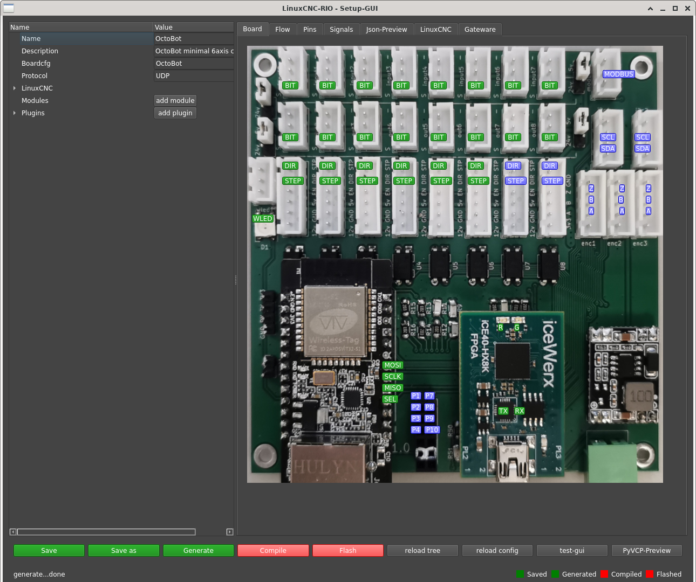

[LinuxCNC-RIO](https://github.com/multigcs/LinuxCNC-RIO) - rewrite

in progress but ready for testing

---


# 

<h3 align="center">LinuxCNC-RIO</h3>

<div align="center">

  [](/LICENSE)

</div>

---

<p align="center"> Realtime-IO for LinuxCNC<br></p>

## Table of Contents
- [About](#about)
- [Help](#help)
- [Plugins/Drivers](#plugins)
- [supported Toolchains](#toolchains)
- [supported Chips/Boards](#chips)
- [Getting Started](#getting_started)
- [Usage](#usage)
- [Flow](#flow)

## About <a name = "about"></a>

LinuxCNC-RIO is a code generator for using FPGA boards as Realtime-IO for LinuxCNC.

Furthermore, the complete configuration and hal is generated.
a json configuration file serves as the basis

## Help <a name = "help"></a>

* [LinuxCNC-Forum (en)](https://forum.linuxcnc.org/18-computer/49142-linuxcnc-rio-realtimeio-for-linuxcnc-based-on-fpga-ice40-ecp5)
* [cnc-aus-holz (de)](https://www.cnc-aus-holz.at/)


## Plugins/Drivers <a name = "plugins"></a>
here is a small overview of the plugins: [PLUGINS](PLUGINS.md)

## supported Toolchains <a name = "toolchains"></a>

* [Icestorm (yosys/nextpnr)](https://github.com/YosysHQ/oss-cad-suite-build)
* [Gowin EDA](https://www.gowinsemi.com/en/support/home/)
* [Intel Quartus](https://www.intel.de/content/www/de/de/products/details/fpga/development-tools/quartus-prime.html)
* [Xilinx/AMD ISE WebPACK](https://www.xilinx.com/products/design-tools/ise-design-suite/ise-webpack.html)
* [Xilinx/AMD Vivado](https://www.xilinx.com/products/design-tools/vivado.html)
* [Lattice Diamond](https://www.latticesemi.com/latticediamond)

## Chips/Boards <a name = "chips"></a>

RIO is largely platform independent and portable to most FPGAs.

[some examples](riocore/boards)


## Getting Started <a name = "getting_started"></a>

installing via git:
```
git clone https://github.com/multigcs/riocore.git
git clone https://github.com/multigcs/riogui.git
cd riocore
```

make sure that the toolchain matching your fpga is in the path:
```
export PATH=$PATH:/opt/oss-cad-suite/bin/
export PATH=$PATH:/opt/Xilinx/Vivado/2023.1/bin/
export PATH=$PATH:/opt/gowin/IDE/bin/
export PATH=$PATH:/opt/intelFPGA_lite/22.1std/quartus/bin/
export PATH=$PATH:/opt/Xilinx/14.7/ISE_DS/ISE/bin/lin64/
```

than copy a config file that is near to your setup:
```
cp riocore/configs/Tangoboard/config-spi.json my_config.json
```

## Usage <a name="usage"></a>

you can edit your configuration file by hand (text-editor) or using the setup tool (rio-setup):
```
PYTHONPATH=. bin/rio-setup my_config.json
```




after setup, you can save your configuration and generate the output-files in the setup-tool via buttons:

* Generate : generates the output-files and write it into the './Output/' folder
* Compile: compiles the Bitfile for your FPGA
* Flash: writes the new bitfile onto the FPGA

you can also do this things on your console:

generate:
```
PYTHONPATH=. bin/rio-generator my_config.json
```
```
loading: my_config.json
loading board setup: TangNano9K
writing gateware to: Output/Tangoboard/Gateware
!!! gateware changed: needs to be build and flash |||
loading toolchain gowin
writing linuxcnc files to: Output/Tangoboard/LinuxCNC
```
compile:
```
(
cd Output/BOARD_NAME/Gateware/
make clean all
)
```

flash:
```
(
cd Output/BOARD_NAME/Gateware/
make load
)
```

You can find all the LinuxCNC related files in 'Output/BOARD_NAME/LinuxCNC/',

to start LinuxCNC, you have to install the new component first:
```
halcompile --install Output/BOARD_NAME/LinuxCNC/rio.c
```
*this step is necessary after every configuration change !*


then you can start LinuxCNC with your new .ini file:
```
linuxcnc Output/BOARD_NAME/LinuxCNC/rio.ini
```

> [!WARNING]
> all files will be overwritte by the generator tool
> 
> if you change the .ini file by hand, for example, you should make a copy of it


### Prerequisites
you need the toolchain for your FPGA or in some cases the https://github.com/YosysHQ/oss-cad-suite-build


## Flow <a name = "flow"></a>
```mermaid
graph LR;
    JSON_CONFIG--rio-generator-->Output;
    JSON_BOARD-->JSON_CONFIG;
    Output-->Gateware;
    Gateware-->Makefile;
    Gateware-->verilog-files;
    Gateware-->pins.*;
    Makefile--make-->Bitfile;
    Output-->LinuxCNC;
    LinuxCNC-->rio.c;
    LinuxCNC-->rio.ini
    LinuxCNC-->rio-gui.xml
    LinuxCNC-->*.hal;
    rio.c--halcompile-->hal-component;
```

