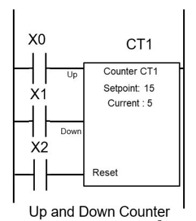

# counter
**pulse counter input**

to counting digital pulses, supporting up,down and reset signals




## Basic-Example:
```
{
    "type": "counter",
    "pins": {
        "up": {
            "pin": "0"
        },
        "down": {
            "pin": "1"
        },
        "reset": {
            "pin": "2"
        }
    }
}
```

## Pins:
*FPGA-pins*
### up:
increment pin

 * direction: input
 * optional: True

### down:
decrement pin

 * direction: input
 * optional: True

### reset:
reset to zero pin

 * direction: input
 * optional: True


## Options:
*user-options*
### name:
name of this plugin instance

 * type: str
 * default: 


## Signals:
*signals/pins in LinuxCNC*
### counter:

 * type: float
 * direction: input


## Interfaces:
*transport layer*
### counter:

 * size: 32 bit
 * direction: input


## Full-Example:
```
{
    "type": "counter",
    "name": "",
    "pins": {
        "up": {
            "pin": "0",
            "modifiers": [
                {
                    "type": "debounce"
                }
            ]
        },
        "down": {
            "pin": "1",
            "modifiers": [
                {
                    "type": "debounce"
                },
                {
                    "type": "invert"
                }
            ]
        },
        "reset": {
            "pin": "2",
            "modifiers": [
                {
                    "type": "debounce"
                },
                {
                    "type": "invert"
                }
            ]
        }
    },
    "signals": {
        "counter": {
            "net": "xxx.yyy.zzz",
            "function": "rio.xxx",
            "scale": 100.0,
            "offset": 0.0,
            "display": {
                "title": "counter",
                "section": "inputs",
                "type": "meter"
            }
        }
    }
}
```

## Verilogs:
 * [counter.v](counter.v)
