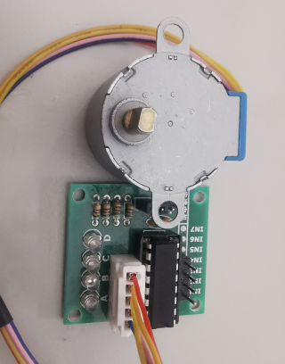

# stepper
**stepper driver output for H-Bridges like L298**

direct stepper driver with 4pin's directly controlled by the FPGA




## Basic-Example:
```
{
    "type": "stepper",
    "pins": {
        "a1": {
            "pin": "0"
        },
        "a2": {
            "pin": "1"
        },
        "b1": {
            "pin": "2"
        },
        "b2": {
            "pin": "3"
        }
    }
}
```

## Pins:
*FPGA-pins*
### a1:

 * direction: output

### a2:

 * direction: output

### b1:

 * direction: output

### b2:

 * direction: output


## Options:
*user-options*
### name:
name of this plugin instance

 * type: str
 * default: 

### axis:
axis name (X,Y,Z,...)

 * type: select
 * default: None

### is_joint:
configure as joint

 * type: bool
 * default: False


## Signals:
*signals/pins in LinuxCNC*
### velocity:
speed in steps per second

 * type: float
 * direction: output
 * min: -1000000
 * max: 1000000
 * unit: Hz

### position:
position feedback

 * type: float
 * direction: input
 * unit: Steps

### enable:

 * type: bit
 * direction: output


## Interfaces:
*transport layer*
### velocity:

 * size: 32 bit
 * direction: output

### position:

 * size: 32 bit
 * direction: input

### enable:

 * size: 1 bit
 * direction: output


## Full-Example:
```
{
    "type": "stepper",
    "name": "",
    "axis": "",
    "is_joint": false,
    "pins": {
        "a1": {
            "pin": "0",
            "modifiers": [
                {
                    "type": "invert"
                }
            ]
        },
        "a2": {
            "pin": "1",
            "modifiers": [
                {
                    "type": "invert"
                }
            ]
        },
        "b1": {
            "pin": "2",
            "modifiers": [
                {
                    "type": "invert"
                }
            ]
        },
        "b2": {
            "pin": "3",
            "modifiers": [
                {
                    "type": "invert"
                }
            ]
        }
    },
    "signals": {
        "velocity": {
            "net": "xxx.yyy.zzz",
            "function": "rio.xxx",
            "scale": 100.0,
            "offset": 0.0,
            "display": {
                "title": "velocity",
                "section": "outputs",
                "type": "scale"
            }
        },
        "position": {
            "net": "xxx.yyy.zzz",
            "function": "rio.xxx",
            "scale": 100.0,
            "offset": 0.0,
            "display": {
                "title": "position",
                "section": "inputs",
                "type": "meter"
            }
        },
        "enable": {
            "net": "xxx.yyy.zzz",
            "function": "rio.xxx",
            "display": {
                "title": "enable",
                "section": "outputs",
                "type": "checkbox"
            }
        }
    }
}
```

## Verilogs:
 * [stepper.v](stepper.v)
