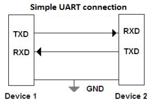

# uartbridge
**uart bridge - experimental - python only**

uart bridge to send and receive custom frames via uart port




## Basic-Example:
```
{
    "type": "uartbridge",
    "pins": {
        "tx": {
            "pin": "0"
        },
        "rx": {
            "pin": "1"
        },
        "tx_enable": {
            "pin": "2"
        }
    }
}
```

## Pins:
*FPGA-pins*
### tx:

 * direction: output

### rx:

 * direction: input

### tx_enable:

 * direction: output
 * optional: True


## Options:
*user-options*
### baud:
serial baud rate

 * type: int
 * min: 300
 * max: 10000000
 * default: 9600
 * unit: bit/s

### rx_buffersize:
max rx buffer size

 * type: int
 * min: 32
 * max: 255
 * default: 40
 * unit: bits

### tx_buffersize:
max tx buffer size

 * type: int
 * min: 32
 * max: 255
 * default: 32
 * unit: bits

### tx_frame:
tx frame format

 * type: str
 * default: tx1:u8|tx2:u8

### rx_frame:
rx frame format

 * type: str
 * default: rx1:u8|rx2:u8

### name:
name of this plugin instance

 * type: str
 * default: 


## Signals:
*signals/pins in LinuxCNC*
the signals of this plugin are user configurable


## Interfaces:
*transport layer*
### rxdata:

 * size: 40 bit
 * direction: input

### txdata:

 * size: 32 bit
 * direction: output


## Full-Example:
```
{
    "type": "uartbridge",
    "baud": 9600,
    "rx_buffersize": 40,
    "tx_buffersize": 32,
    "tx_frame": "tx1:u8|tx2:u8",
    "rx_frame": "rx1:u8|rx2:u8",
    "name": "",
    "pins": {
        "tx": {
            "pin": "0",
            "modifiers": [
                {
                    "type": "invert"
                }
            ]
        },
        "rx": {
            "pin": "1",
            "modifiers": [
                {
                    "type": "debounce"
                },
                {
                    "type": "invert"
                }
            ]
        },
        "tx_enable": {
            "pin": "2",
            "modifiers": [
                {
                    "type": "invert"
                }
            ]
        }
    },
    "signals": {
        "tx1": {
            "net": "xxx.yyy.zzz",
            "function": "rio.xxx",
            "scale": 100.0,
            "offset": 0.0,
            "display": {
                "title": "tx1",
                "section": "outputs",
                "type": "scale"
            }
        },
        "tx2": {
            "net": "xxx.yyy.zzz",
            "function": "rio.xxx",
            "scale": 100.0,
            "offset": 0.0,
            "display": {
                "title": "tx2",
                "section": "outputs",
                "type": "scale"
            }
        },
        "rx1": {
            "net": "xxx.yyy.zzz",
            "function": "rio.xxx",
            "scale": 100.0,
            "offset": 0.0,
            "display": {
                "title": "rx1",
                "section": "inputs",
                "type": "meter"
            }
        },
        "rx2": {
            "net": "xxx.yyy.zzz",
            "function": "rio.xxx",
            "scale": 100.0,
            "offset": 0.0,
            "display": {
                "title": "rx2",
                "section": "inputs",
                "type": "meter"
            }
        }
    }
}
```

## Verilogs:
 * [uartbridge.v](uartbridge.v)
 * [uart_baud.v](uart_baud.v)
 * [uart_rx.v](uart_rx.v)
 * [uart_tx.v](uart_tx.v)
